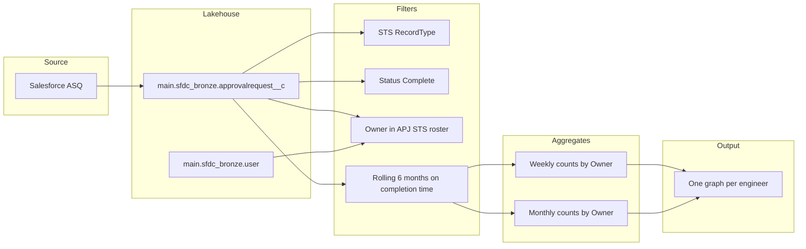

# APJ STS — ASQ completions per engineer (rolling 6 months)

This document defines how to **calculate** Shared Technical Services (STS) ASQs **completed** by each **APJ STS** engineer, aggregated by **calendar week** and **calendar month**, over a **rolling six-month** window, and how to present **one chart per individual**.

---

## 1. Definitions

| Term | Definition |
|------|------------|
| **ASQ object** | Salesforce `ApprovalRequest__c`, exposed in the lakehouse as `approvalrequest__c` (see `main.sfdc_bronze.approvalrequest__c`). |
| **STS ASQs** | Rows where `RecordTypeId = '0128Y000001h44DQAQ'` (Shared Technical Services). |
| **Completed** | `Status__c IN ('Complete', 'Completed')` (both values appear in production data; include both). |
| **Owner (engineer)** | `OwnerId` → `user.Id`. At the latest snapshot, this is the **current** owner; for completed ASQs this is normally the engineer credited with delivery. If an ASQ was reassigned after completion, validate with your Salesforce admin whether owner history should be used instead. |
| **Completion date (time bucket)** | Use a **completion or close timestamp** for bucketing. If your org syncs a dedicated field (e.g. actual end/closed date), prefer that. Otherwise use **`LastModifiedDate`** as a practical proxy for “when the record last moved to completed,” with the caveat that later edits can move the timestamp. Confirm the canonical field with Salesforce / data governance. |
| **Rolling 6 calendar months** | In `run_asq_completions.py`, the warehouse filter is month-aligned: `LastModifiedDate >= DATE_TRUNC('month', ADD_MONTHS(CURRENT_DATE(), -5))` (six calendar months from the first day of “current month − 5 months” through the end of the current month). Charts use the same window and pivot **`monthly.csv`** so bars match SQL counts. |
| **APJ STS roster** | Restrict `OwnerId` to Salesforce users who are APJ STS engineers (see §2). |

---

## 2. APJ STS team members (reference roster)

Use the official HR / STS list as source of truth. Example roster used elsewhere in this repo (names for documentation; **prefer joining on `User.Id` or email** in real queries):

| Name |
|------|
| Louis Chen |
| Pui-Ching Lee |
| Adarsh Nandan (SFDC `User.Name`: **`ADARSH NANDAN`**) |
| Hemapriya N |
| Kavya Parashar |
| Simran Vanjani |
| Haley Won |
| Yotaro Enomoto |
| Anwesha Ghosh |
| Hemanth Rishi |

Add or remove rows as the team changes. **Do not** rely on display names alone in production jobs — maintain a small mapping table (user id → team) if possible.

---

## 3. Base extract (one row per completed ASQ)

Latest snapshot pattern (same idea as `sts-asq-top-accounts-methodology.md`):

```sql
-- Replace completion_ts with your chosen column, e.g. LastModifiedDate or Actual_End__c
WITH latest_ar AS (
  SELECT *
  FROM main.sfdc_bronze.approvalrequest__c
  WHERE processDate = (SELECT MAX(processDate) FROM main.sfdc_bronze.approvalrequest__c)
),
latest_u AS (
  SELECT *
  FROM main.sfdc_bronze.user
  WHERE processDate = (SELECT MAX(processDate) FROM main.sfdc_bronze.user)
),
apj_sts AS (
  -- Prefer a real mapping table; below is illustrative using names
  SELECT Id FROM latest_u
  WHERE Name IN (
    'Louis Chen', 'Pui-Ching Lee', 'ADARSH NANDAN', 'Hemapriya N', 'Kavya Parashar',
    'Simran Vanjani', 'Haley Won', 'Yotaro Enomoto', 'Anwesha Ghosh', 'Hemanth Rishi'
  )
)
SELECT
  ar.Name AS asq_name,
  ar.OwnerId,
  u.Name AS engineer_name,
  ar.Status__c,
  ar.LastModifiedDate AS completion_ts  -- swap if you use a dedicated close date
FROM latest_ar ar
JOIN latest_u u ON ar.OwnerId = u.Id
WHERE ar.RecordTypeId IN ('0128Y000001h44DQAQ')
  AND ar.Status__c IN ('Complete', 'Completed')
  AND ar.OwnerId IN (SELECT Id FROM apj_sts)
  AND CAST(ar.LastModifiedDate AS DATE) >= CAST(DATE_TRUNC('month', ADD_MONTHS(CURRENT_DATE(), -5)) AS DATE)
```

---

## 4. Weekly counts per engineer

**Week start:** Use your org’s standard (e.g. ISO week Monday). In Databricks SQL, `DATE_TRUNC('week', timestamp)` typically aligns to Monday; confirm in your workspace.

Use the same `latest_ar`, `latest_u`, and `apj_sts` definitions as in §3, then:

```sql
WITH latest_ar AS (
  SELECT * FROM main.sfdc_bronze.approvalrequest__c
  WHERE processDate = (SELECT MAX(processDate) FROM main.sfdc_bronze.approvalrequest__c)
),
latest_u AS (
  SELECT * FROM main.sfdc_bronze.user
  WHERE processDate = (SELECT MAX(processDate) FROM main.sfdc_bronze.user)
),
apj_sts AS (
  SELECT Id FROM latest_u
  WHERE Name IN (
    'Louis Chen', 'Pui-Ching Lee', 'ADARSH NANDAN', 'Hemapriya N', 'Kavya Parashar',
    'Simran Vanjani', 'Haley Won', 'Yotaro Enomoto', 'Anwesha Ghosh', 'Hemanth Rishi'
  )
)
SELECT
  u.Name AS engineer_name,
  DATE_TRUNC('week', CAST(ar.LastModifiedDate AS TIMESTAMP)) AS week_start,
  COUNT(*) AS completed_asqs
FROM latest_ar ar
JOIN latest_u u ON ar.OwnerId = u.Id
WHERE ar.RecordTypeId IN ('0128Y000001h44DQAQ')
  AND ar.Status__c IN ('Complete', 'Completed')
  AND ar.OwnerId IN (SELECT Id FROM apj_sts)
  AND CAST(ar.LastModifiedDate AS DATE) >= CAST(DATE_TRUNC('month', ADD_MONTHS(CURRENT_DATE(), -5)) AS DATE)
GROUP BY u.Name, DATE_TRUNC('week', CAST(ar.LastModifiedDate AS TIMESTAMP))
ORDER BY engineer_name, week_start
```

---

## 5. Monthly counts per engineer

```sql
WITH latest_ar AS (
  SELECT * FROM main.sfdc_bronze.approvalrequest__c
  WHERE processDate = (SELECT MAX(processDate) FROM main.sfdc_bronze.approvalrequest__c)
),
latest_u AS (
  SELECT * FROM main.sfdc_bronze.user
  WHERE processDate = (SELECT MAX(processDate) FROM main.sfdc_bronze.user)
),
apj_sts AS (
  SELECT Id FROM latest_u
  WHERE Name IN (
    'Louis Chen', 'Pui-Ching Lee', 'ADARSH NANDAN', 'Hemapriya N', 'Kavya Parashar',
    'Simran Vanjani', 'Haley Won', 'Yotaro Enomoto', 'Anwesha Ghosh', 'Hemanth Rishi'
  )
)
SELECT
  u.Name AS engineer_name,
  DATE_TRUNC('month', CAST(ar.LastModifiedDate AS TIMESTAMP)) AS month_start,
  COUNT(*) AS completed_asqs
FROM latest_ar ar
JOIN latest_u u ON ar.OwnerId = u.Id
WHERE ar.RecordTypeId IN ('0128Y000001h44DQAQ')
  AND ar.Status__c IN ('Complete', 'Completed')
  AND ar.OwnerId IN (SELECT Id FROM apj_sts)
  AND CAST(ar.LastModifiedDate AS DATE) >= CAST(DATE_TRUNC('month', ADD_MONTHS(CURRENT_DATE(), -5)) AS DATE)
GROUP BY u.Name, DATE_TRUNC('month', CAST(ar.LastModifiedDate AS TIMESTAMP))
ORDER BY engineer_name, month_start
```

---

## 6. Graphs — one chart per individual

**Goal:** For **each engineer**, show how completions **trend over the rolling window** using **weekly** and **monthly** series so both short-term noise and monthly cadence are visible.

**Team comparison:** `run_asq_completions.py --charts` writes **`charts/asq_completions_all_engineers_monthly.png`** — **one figure, all engineers**: grouped monthly bars (each month shows N bars for N engineers). Weekly team view: **`charts/asq_completions_team_all_members.png`** (grouped weekly bars, same color per engineer).

### Option A — Databricks SQL / Dashboards

1. Save the weekly query as dataset `asq_weekly` and the monthly query as `asq_monthly`.
2. For **each** engineer, add a chart panel (or use dashboard parameters / small multiples):
   - **Primary series:** column or bar = `completed_asqs` by `week_start`.
   - **Secondary series:** line = `completed_asqs` by `month_start` (or sum of weeks within month — **do not double-count**; prefer the monthly SQL for the line).
3. **X-axis:** time. **Y-axis:** count of ASQs.
4. **Title:** e.g. `STS ASQ completions — {engineer_name} (rolling 6 months)`.

If the dashboard tool does not support two series easily, use **two stacked visuals** for the same person: top = weekly bars, bottom = monthly line.

### Option B — Excel / Google Sheets

1. Export weekly and monthly pivots (engineer in rows or separate sheets per engineer).
2. For each engineer: insert a **Combo chart** — clustered columns (weekly) + line (monthly) on a **secondary axis** if scales differ.
3. Fix the horizontal axis to the rolling six-month range so empty weeks/months show as zero (use a calendar spine left-joined to counts).

### Option C — Python (`run_asq_completions.py --charts`)

Per engineer: **one bar per calendar month** — see `charts/asq_completions_<name>.png`. **All engineers on one chart:** `asq_completions_all_engineers_monthly.png` (grouped bars per month). Raw ASQ rows: `asq_detail.csv`.

Illustrative pattern (manual dashboards): loop over engineers, filter weekly/monthly frames, **align months to mid-month x positions** if overlaying on weekly x (or use **two subplots** per person — simpler and clearer).

```python
import matplotlib.pyplot as plt
import pandas as pd

# weekly_df columns: engineer_name, week_start, completed_asqs
# monthly_df columns: engineer_name, month_start, completed_asqs

for name in weekly_df["engineer_name"].unique():
    w = weekly_df[weekly_df["engineer_name"] == name].sort_values("week_start")
    m = monthly_df[monthly_df["engineer_name"] == name].sort_values("month_start")

    fig, (ax1, ax2) = plt.subplots(2, 1, figsize=(10, 6), sharex=False)
    ax1.bar(w["week_start"], w["completed_asqs"], width=5, color="#4575b4")
    ax1.set_title(f"STS ASQ completions — {name} (rolling 6 months)")
    ax1.set_ylabel("Weekly count")

    ax2.plot(m["month_start"], m["completed_asqs"], marker="o", color="#d73027")
    ax2.set_ylabel("Monthly count")
    ax2.set_xlabel("Month")
    plt.tight_layout()
    plt.savefig(f"asq_completions_{name.replace(' ', '_')}.png", dpi=150)
    plt.close()
```

---

## 7. Data-flow overview



---

## 8. Validation checklist

- [ ] **RecordType** limited to STS (`0128Y000001h44DQAQ`).
- [ ] **Status** includes both `Complete` and `Completed` if both exist.
- [ ] **Roster** matches current APJ STS membership (ids, not only names).
- [ ] **Completion timestamp** agreed with stakeholders (dedicated close date vs `LastModifiedDate`).
- [ ] **Empty buckets:** zero weeks/months with no completions appear as 0 if you need a continuous axis (use a date spine).
- [ ] **Snapshot:** `processDate = MAX(processDate)` for bronze tables so results are reproducible for “as of” reporting.

---

## 9. Runnable script

`run_asq_completions.py` in this folder executes the totals / weekly / monthly queries against Databricks SQL and writes `totals.csv`, `weekly.csv`, and `monthly.csv`. With `--charts` it also runs a **per-ASQ detail** query and writes **`asq_detail.csv`** (`engineer_name`, `asq_name`, `completion_ts`). It emits **`asq_completions_all_engineers_monthly.png`** (single chart: **all engineers**, grouped monthly bars, full month spine), **one PNG per engineer** with monthly bars, and **`asq_completions_team_all_members.png`** (all engineers, grouped **weekly** bars). Requires `matplotlib` and `pandas`. Set `DATABRICKS_SQL_WAREHOUSE_ID` or rely on the first RUNNING warehouse. The script uses **`databricks-cli`** auth (`WorkspaceClient(auth_type="databricks-cli")`); run `databricks auth login --host <workspace-url>` for your profile, or pass `--profile logfood` (etc.). Prefer unsetting `DATABRICKS_TOKEN` when you want CLI OAuth only.

---

## Related documents

- `sts-asq-top-accounts-methodology.md` — STS ASQ joins, RecordType, and `approvalrequest__c` usage.
- `new-asq-triage.md` / `asq-followup-triage.md` — operational statuses and queue context (not used for completed-throughput metrics).
